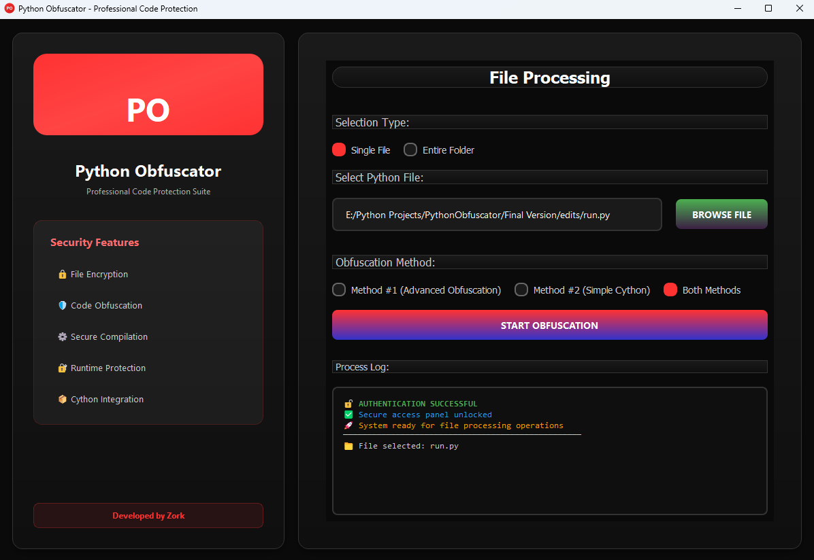

#  Python Cython Obfuscator 🔒

**Professional Python Code Protection Tool**

## ⚡ Features

- 🔒 **Advanced Code Obfuscation** - Multiple protection methods
- ⚡ **Cython Compilation** - Convert Python to optimized binaries
- 📁 **Batch Processing** - Process multiple files at once
- 🎨 **Modern UI** - Clean, professional dark theme interface
- 🛡️ **IP Protection** - Secure your source code from reverse engineering

## 🚀 Quick Start

### 📥 Easy Installation (Must)

1. **Install Visual Studio Build Tools:**
   - Download from [Visual Studio Build Tools](https://visualstudio.microsoft.com/visual-cpp-build-tools/)
   - During installation, select "✓ Desktop development with C++"
   - This includes:
     - MSVC (Microsoft C++ compiler)
     - Windows 10/11 SDK
     - CMake
     - Build tools (MSBuild)
   - These components are required for Python/Cython to compile extensions

2. **Download Latest Release:**
   - Go to [Releases](https://github.com/samay825/Python-To-Cython/releases/tag/v2.0.0)
   - Download the latest ZIP file
   - Extract the ZIP file to your desired location

3. **Run the Application:**
   - Open the extracted folder
   - Double-click `Python Obfuscator.exe` to start

## 🔧 How to Use

1. **Select Target**: Choose a Python file or folder to obfuscate
2. **Choose Method**: Select obfuscation method (Advanced/Simple/Both)
3. **Start Process**: Click "Start Obfuscation" to begin
4. **Get Results**: Find your protected files in the output directory

## 📋 System Requirements

- **OS**: Windows 10/11, Linux, macOS
- **Python**: 3.13.3+
- **RAM**: 4GB minimum
- **Storage**: 1GB free space

## 🛡️ Protection Methods

### Method 1: Advanced Obfuscation
- Variable name scrambling
- Code structure transformation
- String encryption
- Control flow obfuscation

### Method 2: Simple Cython
- Direct Python to C compilation
- Binary output generation
- Performance optimization

## 📝 License

This project is licensed under the MIT License - see the [LICENSE](LICENSE) file for details.

---

**Developed by [Zork Technologies](https://github.com/samay825)**

 
