# Python Cython Obfuscator 🔒

<div align="center">


[](https://www.python.org/)
[](https://www.qt.io/qt-for-python)
[](LICENSE)
[](https://github.com/yourusername/python-cython-obfuscator)
[](https://github.com/yourusername/python-cython-obfuscator/releases/latest)

<p align="center">
A professional-grade Python code protection and obfuscation tool powered by Cython
</p>


</div>

## 📥 Download & Installation

<div align="center">

### [👉 Download the Latest Release Here 👈](https://github.com/samay825/Python-Cython-Obfuscator/releases/tag/v1.0.0)

</div>

### Installation Steps:

1. **Download** the ZIP file from the release page
2. **Extract** the ZIP file to your preferred location
3. **Install Dependencies:**
   ```bash
   pip install -r requirements.txt
   ```
4. **Launch the Application:**
   - Double-click `python-obfuscator.exe` to start the application
   - Alternatively, run via command line: `./python-obfuscator.exe`

## 📋 Overview

Python Cython Obfuscator is an enterprise-level solution for protecting your Python intellectual property. By leveraging Cython's compilation process, it transforms your Python source code into highly optimized and obfuscated binary files, making reverse engineering practically impossible.

<br>

<div align="center">

</div>

## ⚡ Key Features

<div align="center">

| Enterprise Feature | Description |
|---------|-------------|
| 🛡️ **Military-Grade Protection** | Advanced Cython compilation with multiple protection layers |
| 🔄 **Cross-Version Compatibility** | Seamless support for Python 3.10 to 3.13 |
| 🎯 **Enterprise-Ready** | Production-tested with large-scale applications |
| ⚡ **High Performance** | Zero runtime overhead, native execution speed |
| 🔒 **IP Protection** | Comprehensive anti-reverse engineering measures |
| 🎨 **Professional UI** | Modern, responsive dark theme interface |

</div>

## 🚀 Installation & Usage

<div align="right">

</div>

### Prerequisites
- Windows 10/11 or Linux/MacOS
- Python 3.10 or higher
- Administrator privileges for installation

## 🛡️ Security Features

<div align="center">

</div>

### Advanced Protection Mechanisms
- Cython-powered compilation
- Binary-level obfuscation
- Memory protection systems
- Anti-debugging measures
- Runtime integrity checks

### Enterprise Security
- Source code encryption
- Import table protection
- Resource encryption
- Anti-tampering measures

<div align="right">

</div>

## 💼 Professional Features

### Development Integration
- CI/CD pipeline support
- Batch processing capability
- Command-line interface
- Custom build configurations

### Performance Optimization
- Multi-threaded compilation
- Incremental builds
- Smart caching system
- Resource optimization

<div align="center">

</div>

## 🔧 Technical Specifications

```python
ENTERPRISE_FEATURES = {
    "protection_levels": ["basic", "advanced", "enterprise"],
    "supported_python": ["3.10.x", "3.11.x", "3.12.x", "3.13.x"],
    "platforms": ["Windows", "Linux", "MacOS"],
    "compilation": {
        "optimization": "O2",
        "memory_protection": True,
        "anti_debug": True
    }
}
```

## 🌟 Enterprise Roadmap 2025

<div align="center">

</div>

<div align="left">
 AI-powered code optimization<br>
 Cloud-based protection service<br>
 Enterprise management console<br>
 Custom protection rules engine<br>
 Remote build infrastructure<br>
 Advanced analytics dashboard
</div>

## 📚 Documentation

<div align="center">

</div>

For detailed documentation, please visit our [Wiki](https://github.com/samay825/python-cython-obfuscator/wiki)

## 🔄 Workflow

```mermaid
graph TD
    A[Select Python Files] --> B[Configure Protection]
    B --> C[Start Compilation Process]
    C --> D[Generate Protected Binaries]
    D --> E[Create Executable Shortcuts]
    style A fill:#FF3A36,stroke:#333,stroke-width:2px
    style B fill:#2A2A2A,stroke:#333,stroke-width:2px
    style C fill:#FF3A36,stroke:#333,stroke-width:2px
    style D fill:#2A2A2A,stroke:#333,stroke-width:2px
    style E fill:#FF3A36,stroke:#333,stroke-width:2px
```

<div align="center">



</div>

## 🤝 Enterprise Support

<div align="center">

</div>

- Priority email support
- Custom feature development
- Security consultations
- Implementation assistance

## 📝 License

This project is licensed under the MIT License - see the [LICENSE](LICENSE) file for details.

<div align="center">

### Developed by [Zork Technologies](https://github.com/samay825)


<br>

[](https://github.com/yourusername/python-cython-obfuscator)

</div> 
